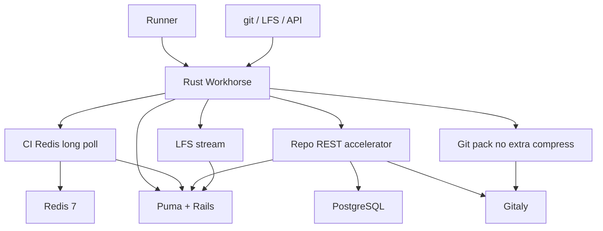

# 非页面路径性能

Feature Name: nonpage-perf
Updated: 2026-09-11

## Description

本轮只加速 git / CI / REST 读，保持 HTML、GraphQL、Web IDE、HTML 注入不动。复用已有 HotPath（session cookie → `project_authorizations` → Gitaly/Redis/磁盘，失败回源 Puma）。

现网对照：Puma 8 worker；`jobs/request` 当前是 50ms 后直转 Puma（等于没有长轮询）；Git pack 会再走全局 `CompressionLayer`。

## Architecture



页面请求继续走现有 `proxy_handler` / GraphQL / staticpages，本图不包含它们。

## Components and Interfaces

### 1. CI long poll

位置：替换 `src/routes/ci_long_polling.rs` 的直转实现。

对齐 CE 19.3.1 Go workhorse：

1. 把 `POST /api/v4/jobs/request` 转到 Puma
2. 若 204 且响应头带 last-update，则按 runner token 订阅 Redis（官方键名以 19.3.1 workhorse 源码为准，实现时对照，禁止自造协议）
3. 等到通知或 `api_ci_long_polling_duration`（默认改为 50s）后，再打一次 Puma
4. Redis 故障 → 单次直转，计 `fallback`

Runner 侧 `check_interval=3` 保持不变。收益是 204 期间 Puma 从「每次 3s 一次完整 Rails」变成「有 job 才进 Rails」。

### 2. Repository REST

新模块：`src/hotpath/repo.rs`，路由挂在现有 `/api/v4/projects/:project_id/repository/*`。

| 路径 | 方法 | 数据 |
|------|------|------|
| `/repository/tree` | GET | Gitaly `GetTreeEntries` / `ListTree` |
| `/repository/commits` | GET | Gitaly `ListCommits` / `FindCommits` |
| `/repository/archive` 与 `archive.:format` | GET | Gitaly 归档 RPC，HTTP 流 |

鉴权复用 `hotpath::session` + `hotpath::acl`。查询白名单：`ref`/`path`/`recursive`/`page`/`per_page`（tree）；`ref_name`/`since`/`until`/`page`/`per_page`（commits）。其它参数回源。

JSON 字段对齐 CE 19.3.1。archive 用 `Body::from_stream`，上限与 Files 的 `max_file_bytes` 无关（流式，不整包）。

### 3. LFS stream

位置：`src/routes/git_lfs.rs`。Batch 仍回源 Rails（权限 + 对象地址）。对象 GET/PUT 在授权 JSON 给出路径或 send-url 时，走现有 `senddata` / `upload::accelerate` 流式，不再把 body 读进 Puma。

第一期只做本地磁盘与已有 send-url；对象存储签名 URL 若授权 JSON 已有则直出。

### 4. Pack 跳过压缩

位置：`src/main.rs` 全局 `CompressionLayer` 与 `src/proxy/mod.rs`。

对 git smart HTTP 响应设置 `Content-Encoding` 身份传输，或在压缩中间件前按路径/Content-Type 跳过。JSON API 与 HTML 继续压缩。

### 5. 明确不改

- `src/html_injection.rs`、`src/webide_nls.rs`、`proxy::graphql_handler`
- Puma worker 数量、Sidekiq 并发（另开运维单）
- `PUT /api/v4/jobs/:id` 与 `PATCH .../trace` 写路径（继续 Rails，Sidekiq 依赖）
- 用 Rust 重写 Rails / Gitaly / Sidekiq

## Data Models

```text
CiPollState {
  runner_token_hash: String
  last_update: Option<String>
  deadline: Instant
}

TreeEntry {
  id, name, type, path, mode
}

CommitListItem {
  id, short_id, title, message, author_name, authored_date, parent_ids
}
```

Session / ACL 与 `2026-09-08-rails-puma` 相同。

## Correctness Properties

- 同一 cookie 下 tree/commits 加速 JSON 与强制回源 JSON 在忽略时间戳后相等（抽样 10 个项目）
- Guest 读 private 仓库 tree 得到 404，与 Files GET 一致
- `jobs/request` 在 Redis 可用时，空闲 50s 内 Puma 对该路径的请求次数低于「每 3s 一次」的基线
- archive 传输期间 Workhorse RSS 增量低于归档文件大小
- Git pack 响应头不含 `Content-Encoding: zstd` / `br` / `gzip`

## Error Handling

| 场景 | 处理 |
|------|------|
| Redis 挂 | `jobs/request` 直转 Puma，计 fallback |
| session 失败 | REST 读回源 |
| 查询参数不在白名单 | 回源，避免静默丢过滤条件 |
| Gitaly 超时 | 回源；回源失败则返回 Puma 状态码 |
| LFS 超 5GiB | 413 |
| 加速 panic | catch 后回源 |

## Test Strategy

1. 单元：tree 路径解析、commits 分页夹紧、pack Content-Type 跳过压缩、204+Redis 超时返回 204
2. 对照：9071 上同一 token 打 tree/commits，加速 vs `X-Gitlab-Rs-Skip-Accel` 回源
3. CI：空闲 runner 抓 Puma access log，长轮询开启前后 `jobs/request` 次数
4. 回归：`cargo test --lib`；已有 Git smart HTTP 与 Files GET 测试保持绿

## Phases

1. Pack 跳过二次压缩（约 0.5 天）— 改动面最小、clone CPU 立刻下降
2. CI Redis 长轮询（约 1.5 天）— 卸 Puma 上的 runner 空转
3. `repository/tree` + `repository/commits` GET（约 2 天）
4. `repository/archive` 流式（约 1 天）
5. LFS 对象流式（约 1 天）

每阶段只热更新 9071 web。用户确认该阶段后再做下一阶段。

## References

[^1]: (Filename) - 现有 CI 直转 `src/routes/ci_long_polling.rs`
[^2]: (Filename) - Files/projects 加速 `src/hotpath/`
[^3]: (Filename) - 全局压缩 `src/main.rs` CompressionLayer
[^4]: (Filename) - 上一轮加速 `.monkeycode/specs/2026-09-08-rails-puma/design.md`
