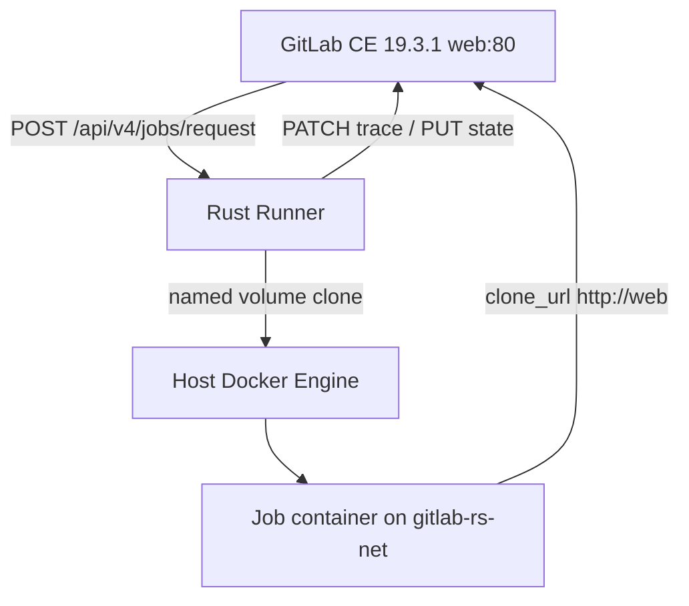

# Rust GitLab Runner

Feature Name: rust-gitlab-runner
Updated: 2026-09-11

## Description

用 Rust 实现可替换官方 `gitlab-runner 19.3.1` 的进程。第一门禁覆盖现网 docker executor：读同一份 `/etc/gitlab-runner/config.toml`，轮询 GitLab CE 19.3.1 的 job API，在 Docker Engine 上跑容器，自管 clone 与 artifacts，不拉取 `gitlab-runner-helper`。

无缝切换：9071 compose 只改 runner 服务的 `image`。配置卷、`docker.sock`、网络、已注册 token 保持原样。镜像内二进制名为 `gitlab-runner`，兼容官方入口 `run --user=... --working-directory=...`（多余参数忽略）。

部署：只热更新 9071 的 `gitlab-rs-cs-runner`。用户复测通过前，不更新 9061，不 `git push`。

## Cluster

Runner 进程无共享磁盘状态。水平扩展 = 多份 `config.toml`（每副本独立 token 或独立 `system_id`）+ 每副本自己的 Docker Engine（`DOCKER_HOST`，默认 unix socket）。GitLab 按 runner token 分发 job；named volume 只活在该副本的 Docker 上。`url` / `clone_url` 指向集群入口（现网 `http://web` 或内网 LB），代码不写死主机名。

## Architecture



Rust Runner 跑在现有 runner 容器里，经 unix socket `/var/run/docker.sock` 调 Docker API。Build 目录用 Docker named volume，clone 在一次性 git 容器里完成，job 容器挂上同一 volume。这样 compose 不必加宿主机 bind，只换镜像。

## Components and Interfaces

代码位置：`runner/` 独立 crate（自己的 `Cargo.toml`），不并入 workhorse 的 package，避免拖累现有编译。

### 1. CLI

二进制安装为 `/usr/bin/gitlab-runner`。

| 调用 | 行为 |
|---|---|
| `gitlab-runner run` | 读 `/etc/gitlab-runner/config.toml` 后开始轮询 |
| `gitlab-runner run --config PATH` | 读指定配置 |
| 官方 `run --user --working-directory` | 解析后忽略，照样 `run` |

未实现的子命令（`register`、`verify`、`unregister`）打印明确错误并以状态 2 退出。9071 已注册，第一门禁不需要 register。

### 2. Config

文件：`runner/src/config.rs`

反序列化现网字段：`concurrent`、`check_interval`、`shutdown_timeout`、`[[runners]]` 的 `name`/`url`/`clone_url`/`token`/`executor`、`[runners.docker]` 的 `image`/`network_mode`/`pull_policy`/`volumes`/`privileged`/`tls_verify`。

`executor != "docker"` 时进程退出码 1，stderr 写 executor 名称。

### 3. GitLab Job Client

文件：`runner/src/api.rs`

HTTP 客户端：`reqwest` + 连接池，base url 来自 `runners.url`。

| 调用 | 用途 |
|---|---|
| `POST /api/v4/jobs/request` | 长轮询；body 带 `info.features` |
| `PUT /api/v4/jobs/:id` | `running` / `success` / `failed` |
| `PATCH /api/v4/jobs/:id/trace` | `Content-Range` 增量日志 |
| `POST /api/v4/jobs/:id/artifacts` | 上传 zip |
| `GET /api/v4/jobs/:id/artifacts` | 下载依赖产物 |

`jobs/request` 的 `info.features` 声明：`variables`、`artifacts`、`artifacts_exclude`、`cache`、`shared`、`multi_build_steps`、`return_exit_code`、`raw_variables`。GitLab 按此决定是否派发 job。

204 时按 `check_interval` 睡眠；值为 0 时用 3s。401 时退出进程，避免错误 token 打爆 API。

### 4. Trace

文件：`runner/src/trace.rs`

内存环形缓冲，满 64KiB 或满 1s 刷一次 PATCH。masked 变量在写入缓冲前替换为 `[MASKED]`。失败终态前先 flush。

### 5. Docker Executor

文件：`runner/src/executor/docker.rs`

Docker API：`bollard`。

流程：

1. 按 `pull_policy`（现网 `if-not-present`）保证 job image 与 git 镜像存在
2. 创建 named volume `grs-job-{job_id}`
3. 一次性容器 `alpine/git:latest` 挂该 volume，用 job 凭证对 `clone_url` 做 `clone` + `checkout SHA`（凭证只进该容器环境，结束后删除容器）
4. 启动 job 容器：工作目录 `/builds`，挂 volume，网络 `network_mode`，环境变量来自 payload，entrypoint 执行拼接后的 `before_script` + `script`（`/bin/sh -lc`）
5. `attach` stdout/stderr 进 trace
6. 退出码 0 则 `success`，否则 `failed`
7. 若有 `after_script`，无论 script 成败都再起一次 exec 或第二段脚本
8. artifacts：再起一次性容器打包 volume 内路径，上传后删除
9. 删除 job/service 容器与 volume

`services`：每个 service 一容器，同一 network，hostname 为 service 名。

现网 `volumes = ["/cache"]`：额外挂 named volume `grs-cache-{runner_id}` 到容器 `/cache`。

### 6. Git 与凭证

clone URL 优先 `clone_url`，把 job `repo_url` 的 path 接到 `clone_url` 的 origin 上（现网 `http://web` + `/namespace/project.git`）。

凭证来自 job payload `credentials` 或 `repo_url` 内嵌 userinfo。写入临时 header `http.extraHeader` 或 url userinfo，仅一次性 git 容器可见。日志与 trace 剥离 token。

第一门禁：`GIT_STRATEGY` 默认 clone。`fetch` / 子模块 / LFS 列入 docker 里程碑补丁，未实现时在 trace 写明并 `failed`（避免假装成功）。

### 7. 镜像与 compose

`runner/Dockerfile`：

```text
FROM debian:bookworm-slim
COPY gitlab-runner /usr/bin/gitlab-runner
ENTRYPOINT ["/usr/bin/gitlab-runner"]
CMD ["run", "--user=gitlab-runner", "--working-directory=/home/gitlab-runner"]
```

9071 标签：`toarujs/gitlab-rs-runner:latest`（只打这个，避免和 9061 的 `gitlab/gitlab-runner:latest` 混用）。

compose 变更仅一行：

```text
image: toarujs/gitlab-rs-runner:latest
```

热更新：`docker compose up -d --no-deps --force-recreate runner`。不动 web/db/redis。

## Data Models

```text
RunnerConfig {
  concurrent: u32
  check_interval: u64
  shutdown_timeout: u64
  runners: Vec<RunnerSection>
}

RunnerSection {
  name, url, clone_url, token, executor: String
  docker: DockerOptions
}

Job {
  id: u64
  token: String
  git_info: GitInfo
  image: JobImage
  services: Vec<JobImage>
  variables: Vec<JobVariable>
  steps: Vec<JobStep>
  artifacts: Vec<JobArtifacts>
  timeout_seconds: u64
}
```

Job JSON 字段名对齐官方 runner 19.3.1 的 request 响应，未知字段忽略。

## Correctness Properties

- 同一 `concurrent` 槽位在 job 终态（success/failed）之前不接新 job
- volume / 容器名带 job id，job 结束后删除
- trace 字节偏移单调递增，与 Content-Range 一致
- config token、job token 不出现在 trace、info 日志、panic hook
- 9071 替换失败可把 compose image 改回 `gitlab/gitlab-runner:latest` 并 recreate runner，配置卷仍在

## Error Handling

| 场景 | 行为 |
|---|---|
| `jobs/request` 204 | 睡 `check_interval` 或 3s |
| `jobs/request` 401 | 退出码 1 |
| clone 失败 | job `failed`，trace 写 git 错误，删 volume |
| 镜像不存在且 pull 失败 | job `failed` |
| Docker daemon 不可达 | 日志 error，该 job `failed`，继续轮询 |
| GitLab PUT/PATCH 5xx | 指数退避重试 3 次，仍失败则本地结束该 job 并打 error |
| SIGTERM | 停接新 job；`shutdown_timeout=0` 时等当前 job 结束 |

## Test Strategy

crate 内单测（不碰真 GitLab）：

1. `config.toml` 现网样例反序列化（token 用占位符）
2. `clone_url` + repo path 拼出实际 git URL
3. masked 变量替换
4. trace Content-Range 切片
5. `executor = "shell"` 时 main 退出码 1

9071 门禁（复测清单）：

1. 建临时项目，`.gitlab-ci.yml` 仅 `image: ubuntu:latest` + `script: echo ok`
2. pipeline 60s 内 success
3. job 日志能看到 `ok`
4. 删测试项目
5. 用户点一次 UI 复测
6. 通过后再考虑 9061 与 git push

## References

[^1]: 现网 9071 `gitlab-rs-cs-runner` config 结构（docker executor, `url=http://web`, `network_mode=gitlab-rs-cs_gitlab-rs-net`）
[^2]: 官方 Runner 19.3.1 job API `POST /api/v4/jobs/request`
[^3]: `.monkeycode/specs/2026-09-11-rust-runner/requirements.md`
