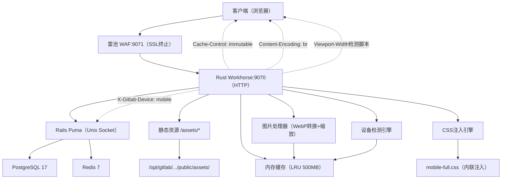
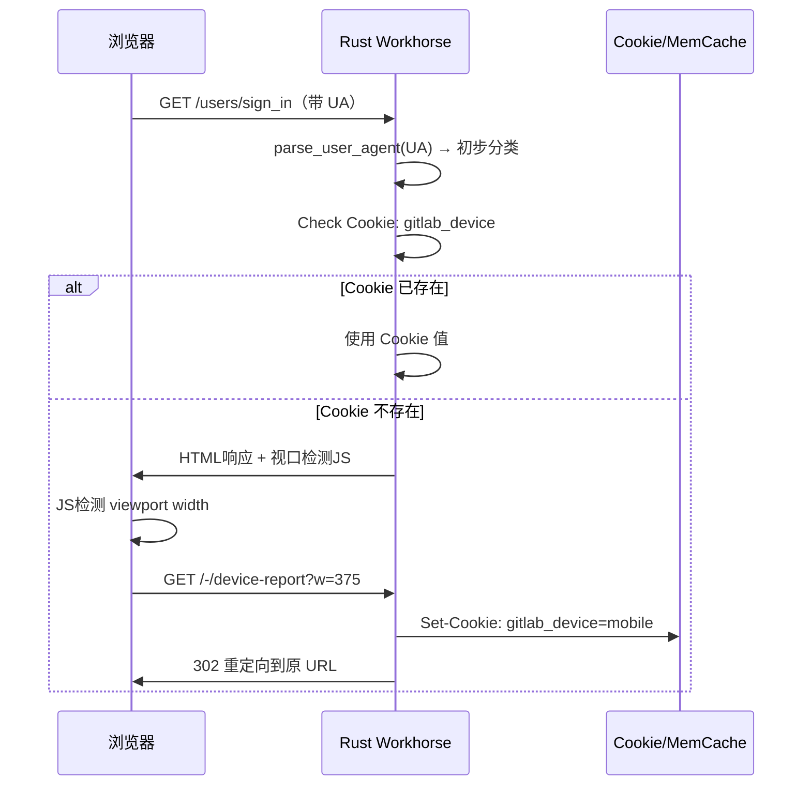
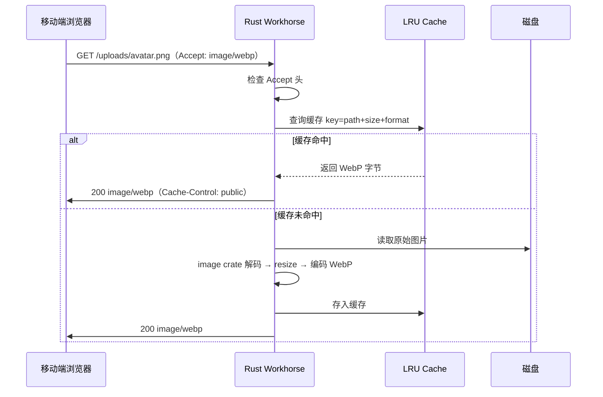

# 移动端网页优化

Feature Name: mobile-web-optimization
Updated: 2026-06-25

## 描述

在 Rust Workhorse 反向代理层实现 Server-side Adaptive Delivery，根据设备类型（桌面/移动）动态优化响应内容，包括：设备检测与二次确认、静态资源预压缩交付、图片按需 WebP 转换、页面 HTML 注入移动端 CSS 和元标记、前端性能指标收集。移动端和桌面端共享完全相同的 URL。

## 架构



## 组件与接口

### 1. 设备检测引擎 (`src/device_detection.rs`)

**职责**：解析 User-Agent 并分类设备类型

**工作流**：


**接口**：
- 输入：HTTP Request（User-Agent、Cookie、Viewport-Width 请求头）
- 输出：设备分类（`DeviceClass::Mobile | Tablet | Desktop`）
- Cookie：`gitlab_device` 持久化设备类型，避免重复检测

### 2. 静态资源压缩服务 (`src/compression.rs`)

**职责**：优先返回预压缩（.br/.gz）版本，对未压缩资源实时压缩

**查找优先级**：
1. `{path}.br`（Brotli，压缩率最高）
2. `{path}.gz`（Gzip，兼容性好）
3. 原始文件 + 实时 Brotli 压缩

**配置**：
- Brotli 压缩级别：对静态资源使用 11（最高），对动态内容使用 4（速度优先）
- 预压缩文件检测：并发检查 `.br` 和 `.gz` 文件存在性（`tokio::join!`）

### 3. 图片处理器 (`src/image_optimizer.rs`)

**职责**：按需转换 WebP、缩放图片、内存缓存

**工作流**：


**依赖**：
- `image` crate：图片编解码、缩放
- `moka` crate（可选）：高性能并发缓存

**缓存策略**：
- 最大容量：500MB（约 5000 张 100KB WebP 图片）
- 淘汰策略：LRU
- TTL：24 小时

### 4. HTML 注入引擎 (`src/html_injection.rs`)

**职责**：对 Rails 返回的 HTML 注入移动端优化内容

**注入点**：
| 注入位置 | 内容 | 条件 |
|----------|------|------|
| `<head>` 末尾 | `<meta name="viewport" content="width=device-width, initial-scale=1">` | 始终 |
| `<head>` 末尾 | 视口检测 JS 脚本 | Cookie `gitlab_device` 不存在 |
| `</head>` 前 | `<style>` 内联移动端 CSS | 设备为 mobile |
| `` 标签 | `loading="lazy" decoding="async"` 属性 | 非首屏图片 |
| `<body>` 开头 | Web Vitals 监控脚本 | 始终 |

**HTML 解析**：使用 `lol_html` crate 进行流式 HTML 重写（零拷贝、低内存）

### 5. 移动端 CSS 文件 (`assets/mobile-full.css`)

**职责**：全面的移动端布局适配样式

**覆盖的页面和组件**：
| 页面/组件 | 适配策略 |
|-----------|----------|
| 全局导航 | 底部固定 TabBar（5 个图标：项目、Issue、MR、CI、更多），顶部仅保留搜索和通知 |
| 侧边栏 | 隐藏，由汉堡菜单触发从左侧滑入的抽屉（drawer） |
| Issue/MR 列表 | 表格 → 卡片布局，每张卡片显示标题、编号、作者、标签、状态 |
| 代码浏览 | 文件树默认折叠，代码区全宽 |
| Diff 视图 | 双列 → 单列纵向，行号左对齐 |
| 登录/注册 | 居中卡片，全宽输入框 |
| 设置页面 | 手风琴折叠分组 |
| 数据表格 | 横向可滚动容器 |
| 按钮/链接 | 最小触控区域 44x44px |

### 6. 前端性能监控

**注入脚本**（在 HTML `<body>` 前注入）：
```javascript
// Web Vitals 上报
const observer = new PerformanceObserver((list) => {
  for (const entry of list.getEntries()) {
    if (entry.entryType === 'largest-contentful-paint') {
      navigator.sendBeacon('/-/web-vitals', JSON.stringify({
        lcp: entry.startTime,
        device: document.cookie.includes('gitlab_device=mobile') ? 'mobile' : 'desktop'
      }));
    }
  }
});
observer.observe({ type: 'largest-contentful-paint', buffered: true });
```

**Workhorse 端点**：`POST /-/web-vitals` 接收上报数据，记录至日志并暴露为 Prometheus 指标。

## 数据模型

### DeviceClass 枚举
```rust
enum DeviceClass {
    Mobile,   // viewport ≤ 768px
    Tablet,   // 768px < viewport ≤ 1024px
    Desktop,  // viewport > 1024px
}
```

### 设备 Cookie
```http
Set-Cookie: gitlab_device=mobile; Path=/; Max-Age=2592000; SameSite=Lax
```

### 图片缓存键
```rust
struct ImageCacheKey {
    path: String,       // 原始路径，如 /uploads/user/avatar/1/avatar.png
    width: u32,         // 目标宽度
    format: ImageFormat, // WebP / Jpeg / Png
}
```

## 正确性约束

1. **URL 不可变性**：任何设备检测或优化不得改变请求 URL 或响应中的链接 URL
2. **非破坏性注入**：HTML 注入不得破坏原有 DOM 结构，只做追加和内联样式插入
3. **缓存在一致性**：原始图片被修改时（如用户更换头像），对应缓存条目必须在 24 小时内自动过期
4. **压缩回退**：若客户端不支持 Brotli/WebP，Workhorse 必须回退到 Gzip/原始格式

## 错误处理

| 场景 | 处理方式 |
|------|----------|
| 图片解码失败 | 返回原始图片，记录 WARN 日志 |
| WebP 编码失败 | 返回原始图片，记录 WARN 日志 |
| 内存缓存满 | LRU 淘汰最旧条目，记录 INFO 日志 |
| HTML 解析失败 | 返回原始 HTML，不做注入 |
| UA 解析异常 | 默认归类为 Desktop |
| 预压缩文件缺失 | 实时压缩，记录 DEBUG 日志 |

## 实现阶段

| 阶段 | 内容 | 预估改动 |
|------|------|----------|
| P1 | 设备检测 + 静态资源预压缩 + 缓存头 | 2 个新模块，~300 行 Rust |
| P2 | HTML 注入 + 视口检测脚本 | 1 个新模块，~200 行 Rust |
| P3 | 图片 WebP 转换 + 缓存 | 新增 image crate，~400 行 Rust |
| P4 | 移动端 CSS + 前端性能监控 | ~800 行 CSS + ~50 行 JS |
| P5 | 端到端测试 + 性能基准 | 集成测试 |

## 测试策略

1. **单元测试**：设备检测引擎（100+ UA 样本）、图片处理器（各种格式输入）
2. **集成测试**：Workhorse 启动后，用不同 UA 和 Accept 头发送请求，验证响应头、响应体
3. **性能基准**：对比优化前后 `/users/sign_in` 的完整加载时间（LCP）、传输大小
4. **端到端**：通过 WAF 访问，使用 Lighthouse Mobile 审计评分

## 参考

[^1]: Rust Workhorse 主程序 - `/workspace/gitlab-workhorse-rs/src/main.rs`
[^2]: 静态文件服务 - `/workspace/gitlab-workhorse-rs/src/staticpages/mod.rs`
[^3]: 代理模块 - `/workspace/gitlab-workhorse-rs/src/proxy/mod.rs`
[^4]: Docker 部署配置 - `/dockerbuild/gitlab/docker-compose.yml`（远程服务器）
